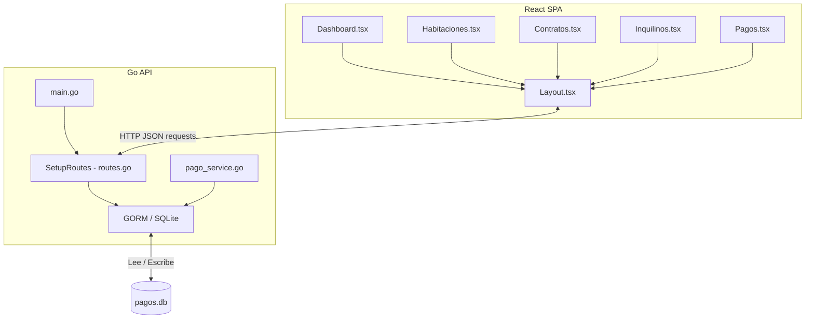

# Sistema de Pagos - Bolívar Host

Este proyecto es una plataforma web completa (Frontend y Backend) diseñada para la administración y control de alquileres y anticréticos de habitaciones/departamentos. Permite gestionar los contratos con los inquilinos, monitorear la disponibilidad física del inmueble y automatizar el cálculo y control de los pagos mensuales.

---

## 🏗️ Arquitectura General

El sistema está dividido en dos partes principales que se comunican a través de una API REST:



### Stack Tecnológico
*   **Frontend:** React (v18), TypeScript, Vite (v5), Tailwind CSS (v3) y React Router (v7).
*   **Backend:** Go (Golang), framework web Gin, GORM (Object Relational Mapping).
*   **Base de Datos:** SQLite (usando el driver libre de CGO `github.com/glebarez/sqlite`).

---

## 🗄️ Modelo de Datos y Base de Datos

La base de datos SQLite contiene tres tablas principales estructuradas en el archivo [models.go](file:///d:/pagosBolivar/backend/internal/models/models.go):

### 1. Habitación (`Habitacion`)
Guarda la información física del cuarto o departamento.
*   `ID` (Clave Primaria)
*   `Numero` (ej: "A-101")
*   `Bloque` (ej: "A", "B")
*   `Nivel` (ej: "Planta Baja", "1er Piso")
*   `TipoHabitacion` (ej: "Simple", "Doble")
*   `TipoBano` (ej: "Privado", "Compartido")
*   `PrecioAlquiler` / `PrecioAnticretico` / `PrecioInternet` (Montos base)
*   `Disponible` (Booleano)
*   `Activo` (Booleano)

### 2. Contrato (`Contrato`)
Vincula un inquilino a una habitación específica y establece las condiciones financieras.
*   `ID` (Clave Primaria)
*   `HabitacionID` (Clave Foránea a `Habitacion`)
*   `InquilinoNombre` (Nombre completo del inquilino)
*   `TipoContrato` (Alquiler o Anticretico)
*   `MontoMensual` (Costo del alquiler mensual; en anticréticos es 0)
*   `MontoServicios` (Cobro fijo por servicios de luz/agua)
*   `IncluyeInternet` (Booleano)
*   `MontoInternet` (Monto adicional por concepto de internet)
*   `MontoGarantia` (Depósito de garantía)
*   `FechaInicio` / `FechaFin`
*   `Estado` (Activo / Inactivo)

### 3. Pago Mensual (`PagoMensual`)
Controla el estado del cobro mes a mes para cada contrato.
*   `ID` (Clave Primaria)
*   `ContratoID` (Clave Foránea a `Contrato`)
*   `Anio` (Año del pago, ej: 2026)
*   `Mes` (Mes del pago, 1-12)
*   `MontoAlquiler`
*   `MontoServicios`
*   `MontoInternet`
*   `MontoTotal` (Calculado como la suma de Alquiler + Servicios + Internet)
*   `MontoPagado` (Dinero recibido hasta la fecha)
*   `FechaVencimiento` (Fecha límite de pago)
*   `FechaPago` (Fecha en la que se realizó la transacción)
*   `EstadoPago` (Pendiente, Pagado, Parcial, Vencido)
*   `Observaciones`

---

## ⚙️ Reglas de Negocio (Lógica de Pagos)

La lógica financiera se implementa en [pago_service.go](file:///d:/pagosBolivar/backend/internal/services/pago_service.go):

1.  **Cálculo del Vencimiento (`CalcularFechaVencimiento`):**
    *   La fecha límite de pago mensual coincide con el día de inicio del contrato. Por ejemplo, si el contrato inició el 5 de enero, los pagos vencerán el día 5 de cada mes respectivo.
    *   Si el día de inicio es superior a los días máximos de un mes de vencimiento (ej: día 31 de inicio y el mes de vencimiento es febrero), se ajustará al último día del mes correspondiente.

2.  **Determinación del Estado (`DeterminarEstadoPago`):**
    *   **Pagado:** El `MontoPagado` cubre o supera el `MontoTotal`.
    *   **Parcial:** El inquilino pagó una fracción del monto total y no ha expirado la fecha de vencimiento.
    *   **Vencido:** La fecha actual es posterior al vencimiento y el `MontoPagado` es inferior al total.
    *   **Pendiente:** El pago no se ha cobrado aún (`MontoPagado = 0`) y la fecha de vencimiento es a futuro.

3.  **Diferencia de Contratos (Alquiler vs. Anticrético):**
    *   En un contrato de tipo *Alquiler*, el cobro mensual incluye el alquiler base (`MontoMensual`) + servicios + internet.
    *   En un contrato de tipo *Anticrético*, el cobro base por concepto de alquiler es 0, por lo que el pago mensual solo cobrará los servicios y el internet del inquilino.

---

## 🔌 Referencia de Endpoints de la API

La API responde por defecto en `http://localhost:8080/api` ([routes.go](file:///d:/pagosBolivar/backend/internal/handlers/routes.go)):

| Método | Endpoint | Descripción |
| :--- | :--- | :--- |
| **GET** | `/dashboard/stats` | Obtiene el total de habitaciones, habitaciones ocupadas/disponibles y contratos activos. |
| **GET** | `/habitaciones` | Obtiene la lista completa de habitaciones. |
| **POST** | `/habitaciones` | Crea una nueva habitación. |
| **PUT** | `/habitaciones/:id` | Modifica los datos de una habitación existente. |
| **GET** | `/contratos` | Obtiene el listado de contratos junto con la habitación asociada (Preload). |
| **POST** | `/contratos` | Registra un nuevo contrato y autogenera la plantilla de pagos mensuales para el año en curso. |
| **PUT** | `/contratos/:id` | Actualiza la información de un contrato (estado, inquilino, montos). |
| **DELETE** | `/contratos/:id` | Elimina un contrato y todos sus pagos mensuales asociados (utilizando una transacción de base de datos). |
| **GET** | `/pagos` | Obtiene el historial de todos los cobros mensuales registrados. |
| **POST** | `/pagos/:id/pagar` | Realiza un pago rápido: marca el estado como `Pagado`, registrando el cobro total en la fecha actual. |

---

## 🚀 Instrucciones para Levantar el Proyecto

### Requisitos Previos
*   Tener instalado **Go** (versión 1.20 o superior).
*   Tener instalado **Node.js** (versión 16 o superior) y **npm**.

### 1. Levantar el Backend (Go)
1.  Navega a la carpeta `/backend`:
    ```bash
    cd backend
    ```
2.  Instala las dependencias y corre el servidor principal:
    ```bash
    go run ./cmd/api/main.go
    ```
    El servidor iniciará y escuchará peticiones en `http://localhost:8080`.

*(Opcional: Si deseas recrear datos de prueba iniciales, puedes correr el seeder con `go run ./cmd/seeder/main.go`).*

### 2. Levantar el Frontend (React)
1.  Navega a la carpeta `/frontend`:
    ```bash
    cd frontend
    ```
2.  Instala los paquetes de npm (si no están instalados):
    ```bash
    npm install
    ```
3.  Inicia el servidor de desarrollo Vite:
    ```bash
    npm run dev
    ```
    La interfaz gráfica estará disponible en tu navegador en [http://localhost:5173](http://localhost:5173).
